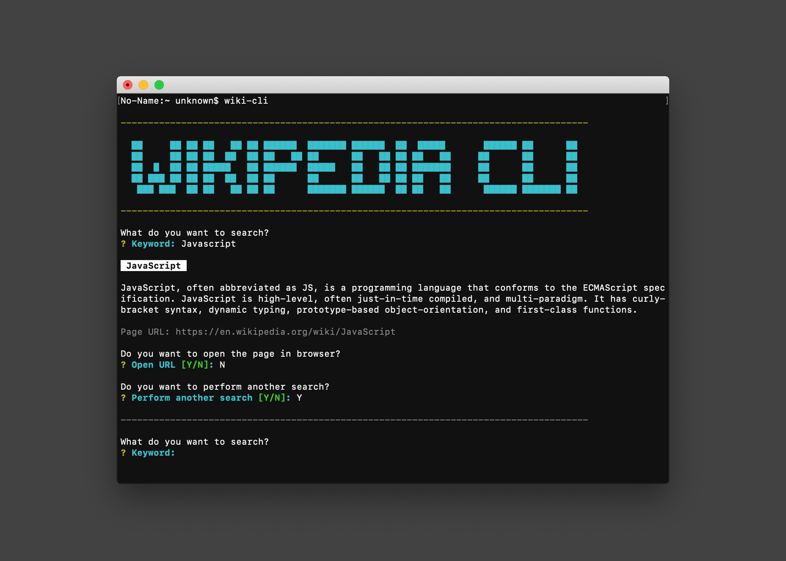

<p align="center">
    
</p>
<h1 align="center">Deno Wikipedia CLI</h1>
<p align="center">
    Search anything on Wikipedia from your terminal.
</p>
<p align="center">
    <a href="https://deno.land/"></a>
    <a href="https://www.typescriptlang.org/"></a>
    <a href="./LICENSE"></a>
    <a href="https://github.com/icelam/deno-wikipedia-cli/actions?query=workflow%3A%22Unit+test%22"></a>
    <a href="https://lgtm.com/projects/g/icelam/deno-wikipedia-cli/context:javascript"></a>
    <a href="https://github.com/icelam/deno-wikipedia-cli/releases"></a>
</p>

## Important Notes
This is a experimental project written in [Deno](https://github.com/denoland/deno) version 1.2.0, with `std` version 0.61.0. Some feature might be unstable at the moment.

## Features
* Get a Wikipedia page
* Display a random Wikipedia page
* Search in different languages

## Installation
You can install the executable directly from GitHub.
```bash
deno install --unstable --allow-net --allow-run --allow-env --allow-read --allow-write -n wiki-cli https://raw.githubusercontent.com/icelam/deno-wikipedia-cli/master/src/mod.ts
```

## Usage
Run `wiki-cli` in your terminal followed by any of the option flags.

A list of valid Wikipedia language codes is available at [https://commons.wikimedia.org/w/api.php?action=sitematrix&smtype=language&smlangprop=code&format=json](https://commons.wikimedia.org/w/api.php?action=sitematrix&smtype=language&smlangprop=code&format=json).

```
Usage: 
  wiki-cli [options]

Options: 
  -h, --help                            Show help and all available options
  -c, --config                          Modify default behavior of wiki-cli, currently support saving default language to be used in search
  -l, --language [WIKI_LANGUAGE_CODE]   Temporary set the target language to be used in search, accepts a Wikipedia language code
  -q, --query [KEYWORD]                 Pre-define the keyword used in search
  -r, --random                          Display a random Wikipedia page
```



## Development
You can run this app locally using the following command:
```bash
make dev
```

## Tests
You can run test cases using the following command:
```bash
make test
```

## Update lock file
You can update the lock file by running the following command:
```bash
make lock-deps
```

## Change Log / Release
Change log is available [here](./CHANGELOG.md).
You can update the change log by running the following command:
```bash
make release
```

A Github workflow has been set to automatically create release when `vX.X.X` tag is pushed.

## Roadmap
* [ ] Implement logging, might introduce something like [log4deno](https://deno.land/x/log4deno)?
* [ ] Use [Import Maps](https://deno.land/manual/linking_to_external_code/import_maps) for better maniaging dependencies' version
* [ ] [Permission detection](https://deno.land/typedoc/classes/deno.permissions.html) without using `--unstable` flag
* [ ] Get [terminal size](https://github.com/denoland/deno/pull/6520) without using `--unstable` flag
* [x] ~~Better way to organize test suits, might consider using [Rhum](https://deno.land/x/rhum)?~~

## Others
* [ ] Limit or [revoke the permission](https://deno.land/manual/examples/permissions) when it is not needed (e.g. search flow does not need write permission, read permission is not needed after getting config file, net is not needed for config flow). But need to test if installed excutable would be affected on next run.
* [ ] Good [reference](https://github.com/drashland/deno-drash/tree/master/tests) for test cases
